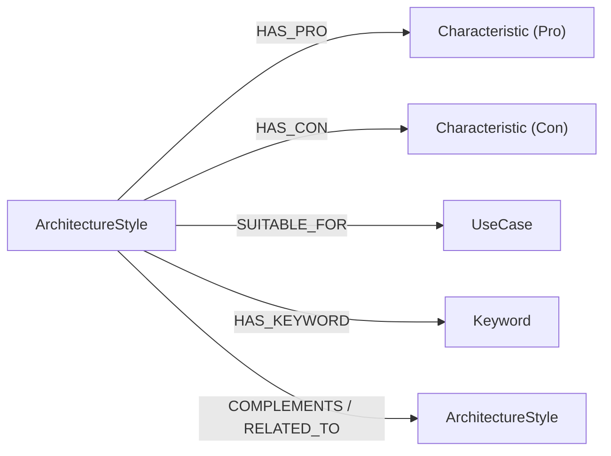

# Neo4j 验收指南（可直接用于答辩）

本文档覆盖 5 项验收要求：

1. 检查初始化脚本可运行  
2. 补充图谱结构说明（节点类型 + 关系类型）  
3. 准备 Neo4j Browser 截图  
4. 准备至少 3 条 Cypher 查询  
5. 说明 Neo4j 不可用时 fallback 到 JSON 的机制  

---

## 1. 初始化脚本检查（可运行 + 可验证）

脚本文件：`init_neo4j.py`

推荐命令：

```powershell
# 幂等写入（不清空已有图）
python init_neo4j.py

# 全量重建（清空后重建）
python init_neo4j.py --reset

# 仅验证图谱核心节点/关系是否存在
python init_neo4j.py --verify-only
```

预期效果：

- 能创建/更新 `ArchitectureStyle`、`Characteristic`、`UseCase`、`Keyword` 节点。
- 能创建核心关系：`HAS_PRO`、`HAS_CON`、`SUITABLE_FOR`、`HAS_KEYWORD`。
- 控制台会输出统计信息（节点数、关系数）用于验收记录。

---

## 2. 图谱结构说明（PPT/实验报告可直接使用）

### 2.1 节点类型

- `ArchitectureStyle`：架构风格（如 CQRS、微服务、事件驱动）
- `Characteristic`：架构优缺点特征
- `UseCase`：适用业务场景
- `Keyword`：触发该架构的关键字

### 2.2 关系类型

- `(:ArchitectureStyle)-[:HAS_PRO]->(:Characteristic)`
- `(:ArchitectureStyle)-[:HAS_CON]->(:Characteristic)`
- `(:ArchitectureStyle)-[:SUITABLE_FOR]->(:UseCase)`
- `(:ArchitectureStyle)-[:HAS_KEYWORD]->(:Keyword)`
- `(:ArchitectureStyle)-[:COMPLEMENTS]->(:ArchitectureStyle)`（互补关系）
- `(:ArchitectureStyle)-[:RELATED_TO]->(:ArchitectureStyle)`（关联关系）

### 2.3 结构图（Mermaid，可贴到支持 Mermaid 的文档）



---

## 3. 截图准备（Neo4j Browser）

### 3.1 打开方式

1. 确保 Neo4j 已启动  
2. 浏览器访问 `http://localhost:7474/`  
3. 登录后执行查询（见第 4 节）

### 3.2 建议截图内容

- 截图 1：节点总览图（看到 `ArchitectureStyle`、`Keyword`、`UseCase`）
- 截图 2：某个架构风格的关键词和场景关系
- 截图 3：架构间互补关系（`COMPLEMENTS` / `RELATED_TO`）

---

## 4. 验收 Cypher 查询（至少 3 条）

### 查询 1：统计架构风格总数

```cypher
MATCH (s:ArchitectureStyle)
RETURN count(s) AS style_count;
```

### 查询 2：查看架构风格与关键词关系

```cypher
MATCH (s:ArchitectureStyle)-[:HAS_KEYWORD]->(k:Keyword)
RETURN s.name AS style, collect(k.name) AS keywords
LIMIT 5;
```

### 查询 3：查看架构间互补/关联关系

```cypher
MATCH (a:ArchitectureStyle)-[r:COMPLEMENTS|RELATED_TO]->(b:ArchitectureStyle)
RETURN a.name AS source, type(r) AS relation, b.name AS target, r.reason AS reason;
```

### 可选查询 4：查看单个架构的全链路信息

```cypher
MATCH (s:ArchitectureStyle {name: 'CQRS (命令查询职责分离)'})
OPTIONAL MATCH (s)-[:HAS_PRO]->(p:Characteristic)
OPTIONAL MATCH (s)-[:HAS_CON]->(c:Characteristic)
OPTIONAL MATCH (s)-[:SUITABLE_FOR]->(u:UseCase)
OPTIONAL MATCH (s)-[:HAS_KEYWORD]->(k:Keyword)
RETURN s.name, collect(DISTINCT p.name) AS pros, collect(DISTINCT c.name) AS cons,
       collect(DISTINCT u.name) AS usecases, collect(DISTINCT k.name) AS keywords;
```

---

## 5. Fallback 说明（Neo4j 不可用时不影响主流程）

代码位置：

- `apps/agent-runtime/agent_runtime/neo4j_kb.py`
- `apps/agent-runtime/agent_runtime/graph.py`

机制说明：

1. `Neo4jKnowledgeBase.is_available()` 先检测 Neo4j 是否可连接。  
2. 如果连接失败/认证失败，记录不可用原因，返回不可用状态。  
3. 上层 `build_knowledge_summary()` 自动回退到 `data/architecture_styles.json`。  
4. 架构推荐主流程继续执行，不因为 Neo4j 不可用而中断。  

答辩可用一句话：

> Neo4j 作为图谱增强层，提升可查询性与可解释性；当 Neo4j 不可用时，系统自动回退 JSON 知识库，保证推荐主流程稳定可运行。

